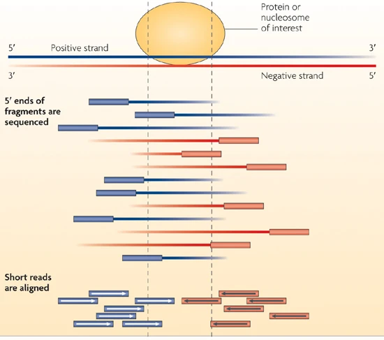
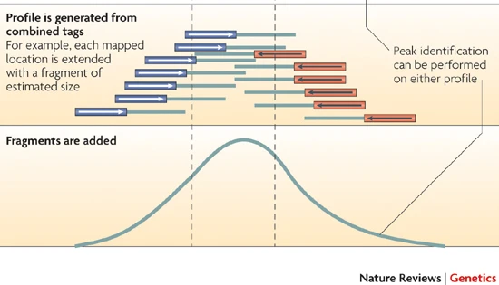

```{r setup, include=FALSE}
knitr::opts_chunk$set(echo = FALSE, message=FALSE, warning=FALSE, results=TRUE)
library(knitr)
```


## Overview

- Introduction
- ChIP-seq  Coverage
- Normalization Methods
- Peak Overlaps
- Statistical Analysis

<p>&nbsp;</p>
<p>&nbsp;</p>

**Source:** https://github.com/tschauer/ChIPseq_Talk

## Introduction

```{r, echo=FALSE, fig.align='center', out.width = "200px"}

```

\begin{center}
\small
Peter J. Park, 2009
\end{center}
<center>


## Introduction

```{r, echo=FALSE, fig.align='center', out.width = "200px"}

```

\begin{center}
\small
Peter J. Park, 2009
\end{center}
<center>

## Overview

- Introduction
- **ChIP-seq  Coverage**
- Normalization Methods
- Peak Overlaps
- Statistical Analysis

<p>&nbsp;</p>
<p>&nbsp;</p>


## ChIP Coverage

```{r, fig.align='center', fig.height=4, fig.width=5}
library(csaw)
library(edgeR)

my_data_folders <- c("H3K36me3", 
                     "H2Av", 
                     "HMR")


for(my_data_selection in my_data_folders){
        
        load(paste0(my_data_selection, "/data.dmel.rda"))
        
        colData(data.dmel)$bam.files <- gsub(".*//|_[G,A,T,C][G,A,T,C][G,A,T,C].*|ChIP", "", colData(data.dmel)$bam.files )

        abundances.data.dmel <- aveLogCPM(asDGEList(data.dmel))
        data.dmel <- data.dmel[abundances.data.dmel > aveLogCPM(10, lib.size=mean(data.dmel$totals))]
        
        
        assays(data.dmel)$adjc <- cpm(asDGEList(data.dmel), log=FALSE)

        assign(paste("data",my_data_selection,"dmel",sep="."), data.dmel)

        rm(list = "data.dmel")
}
```


```{r, fig.align='center', fig.height=4, fig.width=5}
my_sub_ranges <- makeGRangesFromDataFrame(data.frame(chr = "chr2L",
                                                     start = 8240000,
                                                     end = 8340000))

my_colors <- c("#E69F00", "#999999", "#CC79A7", "#009E73", "#D55E00", "#56B4E9", "#F0E442")
```


```{r, fig.align='center', fig.height=4, fig.width=5}
data.dmel <- data.H3K36me3.dmel
data.dmel <- data.dmel[, colData(data.dmel)$bam.files %in% c("GFP_H3K36me3", "GFP_Input")]

data.sub.dmel <- subsetByOverlaps(data.dmel, my_sub_ranges)
my_coordinates <- rowMeans(as.data.frame(rowRanges(data.sub.dmel))[,2:3])

par(mfrow=c(2,2), oma=c(4,3,4,3), mar=c(3,3,1,1), cex=0.7, mgp=c(2,0.75,0))

for(i in 1:2){
        
        plot(my_coordinates/1000, assay(data.sub.dmel, 2)[,i],  
             main = gsub(".*_","", colData(data.sub.dmel)$bam.files)[i],
             type="l", ylab = "norm counts", ylim = c(0,15), xlab = "", col = my_colors[i])
        
        xx <- c((my_coordinates/1000), rev(my_coordinates/1000) )
        yy <- c(assay(data.sub.dmel, 2)[,i], rep(0, length(my_coordinates)))
        
        polygon(xx, yy, border = NA, col =  my_colors[i])
        
        if(i == 2){mtext(text = paste(levels(seqnames(my_sub_ranges)), "[kb]"), side = 1, line = 2, cex=0.75)}
        
        my_density <- density(log2(assay(data.dmel, 2)[,i]+0.1), from=-3, to=5, adjust = 3)
        
        plot(my_density, main = gsub(".*_","", colData(data.dmel)$bam.files)[i],
             xlab = "", col =  my_colors[i], lwd=2)
        
        abline(v = mean(log2(assay(data.dmel, 2)[,i]+0.1)), col =  my_colors[i])
        abline(v = my_density$x[which.max(my_density$y)], lty=3)
        
        if(i == 2){mtext(text ="log2 norm counts", side = 1, line = 2, cex=0.75)}
}

rm(list = "data.dmel")
rm(list = "data.sub.dmel")
```

\small
Catherine Regnard


## ChIP Coverage

```{r, fig.align='center', fig.height=4, fig.width=5}
my_sub_ranges <- makeGRangesFromDataFrame(data.frame(chr = "chr2L",
                                                     start = 8130000,
                                                     end = 8230000))
my_colors <- c("#D55E00","#999999", "#CC79A7", "#009E73",  "#56B4E9","#E69F00",  "#F0E442")
```

```{r, fig.align='center', fig.height=4, fig.width=5}
data.dmel <- data.H2Av.dmel
data.dmel <- data.dmel[, colData(data.dmel)$bam.files %in% c("GFP_H2Av","GST_Input")]

data.sub.dmel <- subsetByOverlaps(data.dmel, my_sub_ranges)
my_coordinates <- rowMeans(as.data.frame(rowRanges(data.sub.dmel))[,2:3])

par(mfrow=c(2,2), oma=c(4,3,4,3), mar=c(3,3,1,1), cex=0.7, mgp=c(2,0.75,0))

for(i in 1:2){
        
        plot(my_coordinates/1000, assay(data.sub.dmel, 2)[,i],  
             main = gsub(".*_","", colData(data.sub.dmel)$bam.files)[i],
             type="l", ylab = "norm counts", ylim = c(0, 15), 
             xlab = "", col = my_colors[i])
        
        xx <- c((my_coordinates/1000), rev(my_coordinates/1000) )
        yy <- c(assay(data.sub.dmel, 2)[,i], rep(0, length(my_coordinates)))
        
        polygon(xx, yy, border = NA, col =  my_colors[i])
        
        if(i == 2){mtext(text = paste(levels(seqnames(my_sub_ranges)), "[kb]"), side = 1, line = 2, cex=0.75)}
        
        my_density <- density(log2(assay(data.dmel, 2)[,i]+0.1), from=-3, to=5, adjust = 3)
        
        plot(my_density, main = gsub(".*_","", colData(data.dmel)$bam.files)[i],
             xlab = "", col =  my_colors[i], lwd=2)
        
        abline(v = mean(log2(assay(data.dmel, 2)[,i]+0.1)), col =  my_colors[i])
        abline(v = my_density$x[which.max(my_density$y)], lty=3)
        
        if(i == 2){mtext(text ="log2 norm counts", side = 1, line = 2, cex=0.75)}
}

rm(list = "data.dmel")
rm(list = "data.sub.dmel")
```

\small
Alessandro Scacchetti


## ChIP Coverage

```{r, fig.align='center', fig.height=4, fig.width=5}
my_sub_ranges <- makeGRangesFromDataFrame(data.frame(chr = "chr2R",
                                                     start = 5680000,
                                                     end = 5720000))
my_colors <- c("#0072B2", "#009E73", "#E69F00", "#D55E00", "#F0E442")
```

```{r, fig.align='center', fig.height=4, fig.width=5}
data.dmel <- data.HMR.dmel
data.dmel <- data.dmel[, colData(data.dmel)$bam.files %in% c("AL66_HMR", "TG04_HP1")]

data.sub.dmel <- subsetByOverlaps(data.dmel, my_sub_ranges)
my_coordinates <- rowMeans(as.data.frame(rowRanges(data.sub.dmel))[,2:3])

par(mfrow=c(2,2), oma=c(4,3,4,3), mar=c(3,3,1,1), cex=0.7, mgp=c(2,0.75,0))

for(i in 1:2){
        
        plot(my_coordinates/1000, assay(data.sub.dmel, 2)[,i],  
             main = gsub(".*_","", colData(data.sub.dmel)$bam.files)[i],
             type="l", ylab = "norm counts", ylim = c(0, ifelse(i == 1, 50, 15)), 
             xlab = "", col = my_colors[i])
        
        xx <- c((my_coordinates/1000), rev(my_coordinates/1000) )
        yy <- c(assay(data.sub.dmel, 2)[,i], rep(0, length(my_coordinates)))
        
        polygon(xx, yy, border = NA, col =  my_colors[i])
        
        if(i == 2){mtext(text = paste(levels(seqnames(my_sub_ranges)), "[kb]"), side = 1, line = 2, cex=0.75)}
        
        my_density <- density(log2(assay(data.dmel, 2)[,i]+0.1), from=-3, to=5, adjust = 3)
        
        plot(my_density, main = gsub(".*_","", colData(data.dmel)$bam.files)[i],
             xlab = "", col =  my_colors[i], lwd=2)
        
        abline(v = mean(log2(assay(data.dmel, 2)[,i]+0.1)), col =  my_colors[i])
        abline(v = my_density$x[which.max(my_density$y)], lty=3)
        
        if(i == 2){mtext(text ="log2 norm counts", side = 1, line = 2, cex=0.75)}
}

rm(list = "data.dmel")
rm(list = "data.sub.dmel")
```

\small
Andrea Lukacs

## Overview

- Introduction
- ChIP-seq  Coverage
- **Normalization Methods**
- Peak Overlaps
- Statistical Analysis

<p>&nbsp;</p>
<p>&nbsp;</p>

## ChIP-seq Normalization

- **Sub-sampling**: random selection of certain number of reads
- **Counts Per Million (CPM)**: divide by the total number reads
- **Background**: remove compostional bias
- **Spike-In**: add constant amount of foreign chromatin


```{r, fig.align='center', fig.height=4, fig.width=5}
library(csaw)
library(edgeR)

my_data_folders <- c("H3K36me3", 
                     "H2Av")


for(my_data_selection in my_data_folders){
        
        load(paste0(my_data_selection, "/bin.dmel.rda"))
        load(paste0(my_data_selection, "/data.dmel.rda"))
        
        colData(bin.dmel)$bam.files <- gsub(".*//|_[G,A,T,C][G,A,T,C][G,A,T,C].*|ChIP", "", colData(bin.dmel)$bam.files )
        colData(data.dmel)$bam.files <- gsub(".*//|_[G,A,T,C][G,A,T,C][G,A,T,C].*|ChIP", "", colData(data.dmel)$bam.files )
        
        abundances.bin.dmel <- aveLogCPM(asDGEList(bin.dmel))
        bin.dmel <- bin.dmel[abundances.bin.dmel > aveLogCPM(500, lib.size=mean(bin.dmel$totals))]
        
        abundances.data.dmel <- aveLogCPM(asDGEList(data.dmel))
        data.dmel <- data.dmel[abundances.data.dmel > aveLogCPM(10, lib.size=mean(data.dmel$totals))]

        
        total.dmel <- colData(bin.dmel)$totals
        bin.dmel$totals <- total.dmel
        
        data.dmel.dmelNorm1 <- data.dmel
        data.dmel.dmelNorm1$totals <- total.dmel 
        data.dmel.dmelNorm1$norm.factors <- normFactors(bin.dmel, se.out = FALSE)
        
        data.dmel.dmelNorm2 <- data.dmel
        data.dmel.dmelNorm2$totals <- total.dmel
        data.dmel.dmelNorm2$norm.factors <- 1
        
        assays(data.dmel.dmelNorm1)$adjc <- cpm(asDGEList(data.dmel.dmelNorm1), log=FALSE)
        assays(data.dmel.dmelNorm2)$adjc <- cpm(asDGEList(data.dmel.dmelNorm2), log=FALSE)
        
        assign(paste("data",my_data_selection,"dmel","Background",sep="."), data.dmel.dmelNorm1)
        assign(paste("data",my_data_selection,"dmel","CPM",sep="."), data.dmel.dmelNorm2)

        rm(list = "data.dmel.dmelNorm1")
        rm(list = "data.dmel.dmelNorm2")
        rm(list = "data.dmel")
        rm(list = "bin.dmel")
}
```


## Background Normalization

- use large bins (10 kb)
- TMM - trimmed mean of M-values
- trim away extreme values
- Bioconductor: csaw package (Lun and Smyth)

 
## Background Normalization

```{r, fig.align='center', fig.height=3.25, fig.width=5}
par(mfrow=c(1,2), oma=c(4,3,4,3), mar=c(3,3,3,1), cex=0.7, mgp=c(2,0.75,0))

for(norm_type in c("CPM","Background")){
        
        data.dmel <- get(paste0("data.H3K36me3.dmel.",norm_type))

        i=17
        my_density <- density(log2(assay(data.dmel, 2)[,i]+0.1), from=-3, to=5, adjust = 3)
        
        plot(my_density, main = norm_type, xlab = "", col =  "#E69F00", lwd=2, ylim = c(0,0.6))
        mtext(text ="log2 norm counts (H3K36me3)", side = 1, line = 2, cex=0.75)
        
        i=2
        my_density <- density(log2(assay(data.dmel, 2)[,i]+0.1), from=-3, to=5, adjust = 3)
        lines(my_density, col = "#999999", lwd=2)
        
        i=7
        my_density <- density(log2(assay(data.dmel, 2)[,i]+0.1), from=-3, to=5, adjust = 3)
        lines(my_density, col = "#999999", lwd=2)
        
        i=22
        my_density <- density(log2(assay(data.dmel, 2)[,i]+0.1), from=-3, to=5, adjust = 3)
        lines(my_density, col = "#E69F00", lwd=2)
        
        legend("topright", legend = gsub("_.*","",colData(data.dmel)$bam.files[c(2,17)]), 
               title = "RNAi", fill = c("#999999", "#E69F00"), cex=0.8)
}

rm(list = "data.dmel")
```

## Background Normalization


```{r, fig.align='center', fig.height=3.25, fig.width=5}
par(mfrow=c(1,2), oma=c(4,3,4,3), mar=c(3,3,3,1), cex=0.7, mgp=c(2,0.75,0))

for(norm_type in c("CPM","Background")){
        
        data.dmel <- get(paste0("data.H2Av.dmel.",norm_type))

        i=16
        my_density <- density(log2(assay(data.dmel, 2)[,i]+0.1), from=-3, to=5, adjust = 3)
        
        plot(my_density, main = norm_type, xlab = "", col =  "#D55E00", lwd=2, ylim = c(0,0.6))
        mtext(text ="log2 norm counts (H2Av)", side = 1, line = 2, cex=0.75)
        
        i=10
        my_density <- density(log2(assay(data.dmel, 2)[,i]+0.1), from=-3, to=5, adjust = 3)
        lines(my_density, col = "#999999", lwd=2)
        
        i=12
        my_density <- density(log2(assay(data.dmel, 2)[,i]+0.1), from=-3, to=5, adjust = 3)
        lines(my_density, col = "#999999", lwd=2)
        
        i=14
        my_density <- density(log2(assay(data.dmel, 2)[,i]+0.1), from=-3, to=5, adjust = 3)
        lines(my_density, col = "#D55E00", lwd=2)
        
        legend("topright", legend = gsub("_.*|2\\..*","",colData(data.dmel)$bam.files[c(10,14)]), 
               title = "RNAi", fill = c("#999999", "#D55E00"), cex=0.8)
}

rm(list = "data.dmel")
```


```{r, fig.align='center', fig.height=4, fig.width=5}
library(csaw)
library(edgeR)

my_data_folders <- c("H3K36me3", 
                     "H2Av")


for(my_data_selection in my_data_folders){
        
        load(paste0(my_data_selection, "/bin.dmel.rda"))
        load(paste0(my_data_selection, "/data.dmel.rda"))
        load(paste0(my_data_selection, "/bin.dvir.rda"))
        load(paste0(my_data_selection, "/data.dvir.rda"))
        
        colData(bin.dmel)$bam.files <- gsub(".*//|_[G,A,T,C][G,A,T,C][G,A,T,C].*|ChIP", "", colData(bin.dmel)$bam.files )
        colData(data.dmel)$bam.files <- gsub(".*//|_[G,A,T,C][G,A,T,C][G,A,T,C].*|ChIP", "", colData(data.dmel)$bam.files )
        colData(bin.dvir)$bam.files <- gsub(".*//|_[G,A,T,C][G,A,T,C][G,A,T,C].*|ChIP", "", colData(bin.dvir)$bam.files )
        colData(data.dvir)$bam.files <- gsub(".*//|_[G,A,T,C][G,A,T,C][G,A,T,C].*|ChIP", "", colData(data.dvir)$bam.files )
        
        abundances.bin.dmel <- aveLogCPM(asDGEList(bin.dmel))
        bin.dmel <- bin.dmel[abundances.bin.dmel > aveLogCPM(500, lib.size=mean(bin.dmel$totals))]
        abundances.data.dmel <- aveLogCPM(asDGEList(data.dmel))
        data.dmel <- data.dmel[abundances.data.dmel > aveLogCPM(10, lib.size=mean(data.dmel$totals))]

        abundances.bin.dvir <- aveLogCPM(asDGEList(bin.dvir))
        bin.dvir <- bin.dvir[abundances.bin.dvir > aveLogCPM(50, lib.size=mean(bin.dvir$totals))]
        abundances.data.dvir <- aveLogCPM(asDGEList(data.dvir))
        data.dvir <- data.dvir[abundances.data.dvir > aveLogCPM(1, lib.size=mean(data.dvir$totals))]
        
        
        total.dvir <- colData(bin.dvir)$totals
        total.dmel <- colData(bin.dmel)$totals
        
        bin.dvir$totals <- total.dmel + total.dvir
        
        data.dmel.dvirNorm1 <- data.dmel
        data.dmel.dvirNorm1$totals <- total.dmel + total.dvir
        data.dmel.dvirNorm1$norm.factors <- normFactors(bin.dvir, se.out = FALSE)
        
        data.dmel.dvirNorm2 <- data.dmel
        data.dmel.dvirNorm2$totals <- total.dvir
        data.dmel.dvirNorm2$norm.factors <- 10
        
        
        assays(data.dmel.dvirNorm1)$adjc <- cpm(asDGEList(data.dmel.dvirNorm1), log=FALSE)
        assays(data.dmel.dvirNorm2)$adjc <- cpm(asDGEList(data.dmel.dvirNorm2), log=FALSE)
        
        assign(paste("data",my_data_selection,"dmel","Background",sep="."), data.dmel.dvirNorm1)
        assign(paste("data",my_data_selection,"dmel","CPM",sep="."), data.dmel.dvirNorm2)

        rm(list = "data.dmel.dvirNorm1")
        rm(list = "data.dmel.dvirNorm2")
        rm(list = "data.dmel")
        rm(list = "bin.dmel")
}
```

## Spike-In Normalization

* Spike-In chromatin:
<p>&nbsp;</p>
  + synthetic
  + different species
* Cell number and chromatin amounts have to be constant!
* Apply CPM or BG normalization on Spike-In reads

## Spike-In Normalization

```{r, fig.align='center', fig.height=3.25, fig.width=5}
par(mfrow=c(1,2), oma=c(4,3,4,3), mar=c(3,3,3,1), cex=0.7, mgp=c(2,0.75,0))

for(norm_type in c("CPM","Background")){
        
        data.dmel <- get(paste0("data.H3K36me3.dmel.",norm_type))

        i=17
        my_density <- density(log2(assay(data.dmel, 2)[,i]+0.1), from=-4, to=5, adjust = 3)
        
        plot(my_density, main = norm_type, xlab = "", col =  "#E69F00", lwd=2, ylim = c(0,0.6))
        mtext(text ="log2 norm counts (H3K36me3)", side = 1, line = 2, cex=0.75)
        
        i=2
        my_density <- density(log2(assay(data.dmel, 2)[,i]+0.1), from=-4, to=5, adjust = 3)
        lines(my_density, col = "#999999", lwd=2)
        
        i=7
        my_density <- density(log2(assay(data.dmel, 2)[,i]+0.1), from=-4, to=5, adjust = 3)
        lines(my_density, col = "#999999", lwd=2)
        
        i=22
        my_density <- density(log2(assay(data.dmel, 2)[,i]+0.1), from=-4, to=5, adjust = 3)
        lines(my_density, col = "#E69F00", lwd=2)
        
        legend("topright", legend = gsub("_.*","",colData(data.dmel)$bam.files[c(2,17)]), 
               title = "RNAi", fill = c("#999999", "#E69F00"), cex=0.8)
}

rm(list = "data.dmel")
```


## Spike-In Normalization

```{r, fig.align='center', fig.height=3.25, fig.width=5}
par(mfrow=c(1,2), oma=c(4,3,4,3), mar=c(3,3,3,1), cex=0.7, mgp=c(2,0.75,0))

for(norm_type in c("CPM","Background")){
        
        data.dmel <- get(paste0("data.H2Av.dmel.",norm_type))

        i=16
        my_density <- density(log2(assay(data.dmel, 2)[,i]+0.1), from=-4, to=5, adjust = 3)
        
        plot(my_density, main = norm_type, xlab = "", col =  "#D55E00", lwd=2, ylim = c(0,0.8))
        mtext(text ="log2 norm counts (H2Av)", side = 1, line = 2, cex=0.75)
        
        i=10
        my_density <- density(log2(assay(data.dmel, 2)[,i]+0.1), from=-4, to=5, adjust = 3)
        lines(my_density, col = "#999999", lwd=2)
        
        i=12
        my_density <- density(log2(assay(data.dmel, 2)[,i]+0.1), from=-4, to=5, adjust = 3)
        lines(my_density, col = "#999999", lwd=2)
        
        i=14
        my_density <- density(log2(assay(data.dmel, 2)[,i]+0.1), from=-4, to=5, adjust = 3)
        lines(my_density, col = "#D55E00", lwd=2)
        
        legend("topright", legend = gsub("_.*|2\\..*","",colData(data.dmel)$bam.files[c(10,14)]), 
               title = "RNAi", fill = c("#999999", "#D55E00"), cex=0.8)
}

rm(list = "data.dmel")
```

## Spike-In Normalization

* When to use Spike-Ins?
<p>&nbsp;</p>
  + global effect
  + effect has to be larger than variability
  + more replicates might be required

## Overview

- Introduction
- ChIP-seq  Coverage
- Normalization Methods
- **Peak Overlaps**
- Statistical Analysis

<p>&nbsp;</p>
<p>&nbsp;</p>


## Peak Overlaps

<p>&nbsp;</p>
* overlap counting rules
<p>&nbsp;</p>


```{r, fig.align='left', fig.height=4, fig.width=10, dpi=200, out.width='75%'}
library(HelpersforChIPSeq)

data_dir <- system.file("extdata/", package = "HelpersforChIPSeq")
bed_files <- file.path(data_dir, list.files(path = data_dir, pattern = ".bed$"))

ranges_1 <- rtracklayer::import(bed_files[1])
ranges_2 <- rtracklayer::import(bed_files[2])


cbPalette <- c("#E69F00", "#56B4E9", "#999999", "#009E73", "#F0E442", "#0072B2", "#D55E00", "#CC79A7")

my_region <- makeGRangesFromDataFrame(data.frame(chr = "chr2L", 
                                                 start = 10714000, 
                                                 end = 10748000))

ranges_1_region <- subsetByOverlaps(ranges_1, my_region)
ranges_2_region <- subsetByOverlaps(ranges_2, my_region)

my_granges_names = c("ranges_1_region","ranges_2_region")

my_pooled_ranges <- GenomicRanges::GRanges()

for(i in seq_along(my_granges_names)){
        my_pooled_ranges <- append(my_pooled_ranges, get(my_granges_names[i]))
}

my_pooled_ranges <- reduce(my_pooled_ranges,
                           min.gapwidth = 0L, 
                           ignore.strand = TRUE)
my_pooled_ranges$range_id <- paste("range", seq_along(my_pooled_ranges), sep="_")

for(i in seq_along(my_granges_names)){
        
        my_overlaps <- !(is.na(findOverlaps(my_pooled_ranges, get(my_granges_names[i]), select="arbitrary")))
        mcols(my_pooled_ranges) <- cbind(mcols(my_pooled_ranges), my_overlaps)
        colnames(mcols(my_pooled_ranges))[i+1] <- my_granges_names[i]
}

par(mfrow=c(6,1),mar = c(1,3,1,3))


plotRanges(ranges_1_region, 
           my_region = my_region, 
           my_title = "set #1 (n=6)", my_color = cbPalette[1])

plotRanges(ranges_2_region,  
           my_region = my_region, 
           my_title = "set #2 (n=4)", my_color = cbPalette[2])

plotRanges(my_pooled_ranges,  my_region = my_region,  
           my_title = "pool (n=6)", my_color = cbPalette[3])

plotRanges(my_pooled_ranges[my_pooled_ranges$ranges_1_region & my_pooled_ranges$ranges_2_region],
           my_region = my_region, 
           my_title = "overlap (n=3)", my_color = cbPalette[7])

plotRanges(my_pooled_ranges[my_pooled_ranges$ranges_1_region & !(my_pooled_ranges$ranges_2_region)], 
           my_region = my_region, 
           my_title = "no overlap #1 (n=2)", my_color = cbPalette[1])

plotRanges(my_pooled_ranges[my_pooled_ranges$ranges_2_region & !(my_pooled_ranges$ranges_1_region)], 
           my_region = my_region, 
           my_title = "no overlap #2 (n=1)", my_color = cbPalette[2])

par(fig=c(0,1,0,1), mar=c(0,0,0,0), oma=c(0,0,0,0), new=TRUE)
plot.new()
abline(h = c(4/6,3/6), lty=2)
```

```{r message=FALSE, warning=FALSE,results=FALSE, fig.align='right', fig.height=4, fig.width=4, dpi=200, out.width='33%'}
# 2-way comparison
plotVennOverlaps(my_granges_names = c("ranges_1_region","ranges_2_region"),
                 my_labels = c("#1", "#2"),
                 my_venn_colors = cbPalette)
```

## Peak Overlaps


```{r message=FALSE, warning=FALSE,results=FALSE, fig.align='center', fig.height=5, fig.width=5, dpi=200, out.width='50%'}
cbPalette <- c("#E69F00", "#D55E00", "#56B4E9", "#999999", "#009E73", "#F0E442", "#0072B2", "#CC79A7")

ranges_1 <- rtracklayer::import("H3K36me3/H3K36me3_GFP.dmelNorm.bed")
ranges_2 <- rtracklayer::import("H2Av/H2Av_GFP.dmelNorm.bed")

# 2-way comparison
plotVennOverlaps(my_granges_names = c("ranges_1","ranges_2"),
                 my_labels = c("H3K36me3", "H2Av"),
                 my_venn_colors = cbPalette)
```

* reviewers question: is this significant?


## Peak Overlaps

* 2x2 contingency table

```{r, results='asis'}
m <- matrix(c(1957, 1899, 1784, NA), nrow = 2,
       dimnames = list(H3K36me3 = c("Yes", "No"),
                       H2Av = c("Yes", "No")))

df <- data.frame(`H2Av / H3K36me3` = c("Yes", "No"), Yes = c(m[1,1],m[2,1]), No = c(m[1,2], m[2,2]), check.names = FALSE)
kable(df, row.names = FALSE)
```

* what should be the number of unbound regions?
<p>&nbsp;</p>
* use gene-based approach (unbound genes)?
* formula? 
$$n = \frac{GenomeSize * (Fraction_{coding} + Fraction_{regulatory})}{(2 * PeakWidth)}$$

## Peak Overlaps


```{r, results='asis'}
library(TxDb.Dmelanogaster.UCSC.dm6.ensGene)

m[2,2] <- round(sum(width(reduce(exons(TxDb.Dmelanogaster.UCSC.dm6.ensGene), ignore.strand=TRUE))) / (2*2000))

df <- data.frame(`H2Av / H3K36me3` = c("Yes", "No"), Yes = c(m[1,1],m[2,1]), No = c(m[1,2], m[2,2]), check.names = FALSE)
kable(df, row.names = FALSE)
```
<p>&nbsp;</p>
```{r, results='asis'}
ft <- fisher.test(m)

cat("Odds Ratio 95% CI =", paste(round(ft$conf.int, 2), collapse = " - "))
```
<p>&nbsp;</p>
```{r, results='asis'}
cat("Fisher´s exact test p-value <", ifelse(ft$p.value > 2.2e-16, ft$p.value, 2.2e-16  ))
```
<p>&nbsp;</p>
* What is wrong here?

## Peak Overlaps


```{r, results='asis'}
m[2,2] <- 2000
        
df <- data.frame(`H2Av / H3K36me3` = c("Yes", "No"), Yes = c(m[1,1],m[2,1]), No = c(m[1,2], m[2,2]), check.names = FALSE)
kable(df, row.names = FALSE)
```
<p>&nbsp;</p>
```{r, results='asis'}
ft <- fisher.test(m)

cat("Odds Ratio 95% CI =", paste(round(ft$conf.int, 2), collapse = " - "))
```
<p>&nbsp;</p>
```{r, results='asis'}
cat("Fisher´s exact test p-value <", format(ft$p.value, digits = 2, scientific = TRUE))
```
<p>&nbsp;</p>
* What is wrong here?


## Peak Overlaps

* Fisher´s exact test
<p>&nbsp;</p>
  + hard to interpret such p-values
  + p-value is highly dependent on 'N'
  + main problem: 'N' is number of peaks
  + peaks are likely not independent
  + no information about replicates
 <p>&nbsp;</p>
 <p>&nbsp;</p>
  + NOT recommended

## Peak Overlaps


```{r, fig.align='center', fig.height=3.5, fig.width=10, dpi=200, out.width='75%'}
library(HelpersforChIPSeq)

data_dir <- system.file("extdata/", package = "HelpersforChIPSeq")
bed_files <- file.path(data_dir, list.files(path = data_dir, pattern = ".bed$"))

ranges_1 <- rtracklayer::import(bed_files[1])
ranges_2 <- rtracklayer::import(bed_files[2])


cbPalette <- c("#E69F00", "#56B4E9", "#999999", "#009E73", "#F0E442", "#0072B2", "#D55E00", "#CC79A7")

my_region <- makeGRangesFromDataFrame(data.frame(chr = "chr2L", 
                                                 start = 10714000, 
                                                 end = 10748000))

ranges_1_region <- subsetByOverlaps(ranges_1, my_region)
ranges_2_region <- subsetByOverlaps(ranges_2, my_region)

my_granges_names = c("ranges_1_region","ranges_2_region")

my_pooled_ranges <- GenomicRanges::GRanges()

for(i in seq_along(my_granges_names)){
        my_pooled_ranges <- append(my_pooled_ranges, get(my_granges_names[i]))
}

my_pooled_ranges <- reduce(my_pooled_ranges,
                           min.gapwidth = 0L, 
                           ignore.strand = TRUE)
my_pooled_ranges$range_id <- paste("range", seq_along(my_pooled_ranges), sep="_")

for(i in seq_along(my_granges_names)){
        
        my_overlaps <- !(is.na(findOverlaps(my_pooled_ranges, get(my_granges_names[i]), select="arbitrary")))
        mcols(my_pooled_ranges) <- cbind(mcols(my_pooled_ranges), my_overlaps)
        colnames(mcols(my_pooled_ranges))[i+1] <- my_granges_names[i]
}

par(mfrow=c(4,1),mar = c(1,3,1,3), cex=1.1)


plotRanges(ranges_1_region, 
           my_region = my_region, 
           my_title = "set #1", my_color = cbPalette[1])

plotRanges(ranges_2_region,  
           my_region = my_region, 
           my_title = "set #2", my_color = cbPalette[2])

plotRanges(union(ranges_1_region, ranges_2_region),  my_region = my_region,  
           my_title = "union", my_color = cbPalette[3])

plotRanges(intersect(ranges_1_region, ranges_2_region),
           my_region = my_region, 
           my_title = "intersect", my_color = cbPalette[7])


par(fig=c(0,1,0,1), mar=c(0,0,0,0), oma=c(0,0,0,0), new=TRUE)
plot.new()
abline(h = 2/4, lty=2)
```

<p>&nbsp;</p>
* Jaccard Similarity Index

$$Jaccard = \frac{Length_{intersect}}{Length_{union} - Length_{intersect}}$$

```{r, results='asis'}
Jaccard <- function(gr1, gr2){
        ri <- sum(width(intersect(gr1, gr2, ignore.strand = TRUE)))
        ru <- sum(width(union(gr1, gr2, ignore.strand = TRUE)))
        
        JI <- ri/ru
        return(JI)
}

JI <- Jaccard(ranges_1_region, ranges_2_region)
```

* Value: 0 - 1 
* Example: `r round(JI,2)`


## Peak Overlaps

<p>&nbsp;</p>
* H3K36me3 vs H2Av vs HP1 
<p>&nbsp;</p>

```{r message=FALSE, warning=FALSE,results=FALSE, fig.align='center', fig.height=6.5, fig.width=6.5, dpi=200, out.width='60%'}
cbPalette <- c("#E69F00", "#D55E00", "#56B4E9", "#999999", "#009E73", "#F0E442", "#0072B2", "#CC79A7")

ranges_H3K36me3_1 <- rtracklayer::import("H3K36me3/H3K36me3_GFP.dmelNorm.bed")
ranges_H3K36me3_2 <- rtracklayer::import("H3K36me3/H3K36me3_GST.dmelNorm.bed")

ranges_H2Av_1 <- rtracklayer::import("H2Av/H2Av_GFP.dmelNorm.bed")
ranges_H2Av_2 <- rtracklayer::import("H2Av/H2Av_GST.dmelNorm.bed")

ranges_HP1 <- rtracklayer::import("HMR/HP1a.histone.F4.bed")

m <- matrix(nrow = 5, ncol = 5, dimnames = list(c("H3K36me3_1","H3K36me3_2", "H2Av_1","H2Av_2", "HP1"),
                                                c("H3K36me3_1","H3K36me3_2", "H2Av_1","H2Av_2", "HP1")))

for(cn in colnames(m)){
        
        for(rn in rownames(m)){
                
                m[rn, cn] <- Jaccard(gr1 = get(paste0("ranges_", rn)),
                                     gr2 = get(paste0("ranges_", cn)))
        }
}

library(pheatmap)
library(RColorBrewer)

pheatmap(m, main = "Jaccard",
         display_numbers = TRUE,
         fontsize = 16,
         fontsize_number = 14,
         breaks = seq(0,1, length.out = 101),
         color = colorRampPalette(brewer.pal(9, "Blues"))(100))

```


## Overview

- Introduction
- ChIP-seq  Coverage
- Normalization Methods
- Peak Overlaps
- **Statistical Analysis**

<p>&nbsp;</p>
<p>&nbsp;</p>

## Statistical Analysis
<p>&nbsp;</p>


```{r message=FALSE, warning=FALSE,results=FALSE, fig.align='center', fig.height=5, fig.width=5, dpi=200, out.width='50%'}
library(gdata)

SampleTable <- read.xls("HMR/SampleTable.xlsx", stringsAsFactors = F)

SampleTable_FLAG <- SampleTable[SampleTable$sample == "FLAG",]
SampleTable_FLAG <- SampleTable_FLAG[order(SampleTable_FLAG$id),]

my_binning <- 10

#########################################################


my_mats <- file.path("matrix/" ,list.files(path = "matrix/", pattern = paste("mat", "FLAG_pool", sep=".")))

for(i in seq_along(my_mats)){
        
        load(my_mats[i])
        
}


#########################################################


my_mats <- ls(pattern = "mat.FLAG_pool.[A,H]")


my_peak_ids <-  rownames(get(my_mats[1]))

for(i in seq_along(my_mats)){
        my_peak_ids <- intersect(my_peak_ids, rownames(get(my_mats[i])))
}


#########################################################

for(i in seq_along(my_mats)){
        
        my_mat <- get(my_mats[i])
        
        my_mat <- as.matrix(my_mat[rownames(my_mat) %in% my_peak_ids,])
        my_mat <- as.matrix(my_mat[order(rownames(my_mat)),])
        
        # Z-score scaling
        my_mat <- (my_mat - mean(my_mat))/sd(my_mat)
        
        assign(my_mats[i], my_mat)
}


#########################################################


my_threshold <- quantile(rowMeans(mat.FLAG_pool.HP1a.INPnorm), 0.90)

my_set1 <- which(rowMeans(mat.FLAG_pool.HP1a.INPnorm) > my_threshold &
                         rowMeans(mat.FLAG_pool.HP1a.INPnorm[,(ncol(mat.FLAG_pool.HP1a.INPnorm)*0.2):(ncol(mat.FLAG_pool.HP1a.INPnorm)*0.5)]) > 
                         rowMeans(mat.FLAG_pool.HP1a.INPnorm[,(ncol(mat.FLAG_pool.HP1a.INPnorm)*0.5):(ncol(mat.FLAG_pool.HP1a.INPnorm)*0.8)]))

my_set2 <- which(rowMeans(mat.FLAG_pool.HP1a.INPnorm) > my_threshold &
                         rowMeans(mat.FLAG_pool.HP1a.INPnorm[,(ncol(mat.FLAG_pool.HP1a.INPnorm)*0.2):(ncol(mat.FLAG_pool.HP1a.INPnorm)*0.5)]) < 
                         rowMeans(mat.FLAG_pool.HP1a.INPnorm[,(ncol(mat.FLAG_pool.HP1a.INPnorm)*0.5):(ncol(mat.FLAG_pool.HP1a.INPnorm)*0.8)]))


my_set3 <- (1:nrow(mat.FLAG_pool.HP1a.INPnorm))[-1*as.integer(c(my_set1,my_set2))]

#########################################################
```


```{r message=FALSE, warning=FALSE,results=FALSE, fig.align='center', fig.height=6, fig.width=8, dpi=200, out.width='80%'}
my_mats <- ls(pattern = "mat.FLAG_pool.[A,H]")

mat.FLAG_pool.FLAG_FL_induced <- averageMats(grep(paste(SampleTable_FLAG$id[SampleTable_FLAG$genotype == "Hmr_Flag_FL_induced"], collapse = "|"), my_mats, value = TRUE))
mat.FLAG_pool.FLAG_dC_induced <- averageMats(grep(paste(SampleTable_FLAG$id[SampleTable_FLAG$genotype == "Hmr_Flag_deltaC_induced"], collapse = "|"), my_mats, value = TRUE))


par(mfrow=c(1,2), mar=c(3,5,3,0.1), oma=c(3,3,3,3), cex.lab=1.5, cex.axis=1.25, cex.main = 1.5, mgp = c(3,1,0))


###########################################

plot(colMeans(mat.FLAG_pool.FLAG_dC_induced), xaxt = "n", xlab = "",
     type="n", ylim=c(-1,6), main = "Class1", ylab = "ChIP Z-Score")

x_range <- ncol(mat.FLAG_pool.FLAG_dC_induced)

axis(side = 1, at = seq(1, x_range , length.out = 3),
     labels =  c( paste("+",round((x_range/2)*my_binning/1000), "kb", sep="") ,
                  "0",
                  paste("+",round((x_range/2)*my_binning/1000), "kb", sep="")))


###########################################

if(all(identical(rownames(mat.FLAG_pool.FLAG_dC_induced), rownames(mat.FLAG_pool.HP1a.INPnorm)),
       identical(rownames(mat.FLAG_pool.FLAG_FL_induced), rownames(mat.FLAG_pool.HP1a.INPnorm)),
       identical(rownames(mat.FLAG_pool.FLAG_dC_induced[c(my_set2,my_set1),]), names(c(my_set2,my_set1))),
       identical(rownames(mat.FLAG_pool.FLAG_FL_induced[c(my_set2,my_set1),]), names(c(my_set2,my_set1))))){
        
        lines(colMeans(mat.FLAG_pool.FLAG_dC_induced[c(my_set2,my_set1),], na.rm = TRUE), col = "#003366", lwd=3)
        lines(colMeans(mat.FLAG_pool.FLAG_FL_induced[c(my_set2,my_set1),], na.rm = TRUE), col = "#99CCFF", lwd=3)
}

legend("top", legend = c("FLAG FL", "FLAG dC"), col = c("#99CCFF", "#003366"), lwd=3)


###########################################


plot(colMeans(mat.FLAG_pool.FLAG_dC_induced), xaxt = "n", xlab = "",
     type="n", ylim=c(-1,6), main = "Class2", ylab = "ChIP Z-Score")


axis(side = 1, at = seq(1, x_range , length.out = 3),
     labels =  c( paste("+",round((x_range/2)*my_binning/1000), "kb", sep="") ,
                  "0",
                  paste("+",round((x_range/2)*my_binning/1000), "kb", sep="")))


###########################################

if(all(identical(rownames(mat.FLAG_pool.FLAG_dC_induced), rownames(mat.FLAG_pool.HP1a.INPnorm)),
       identical(rownames(mat.FLAG_pool.FLAG_FL_induced), rownames(mat.FLAG_pool.HP1a.INPnorm)),
       identical(rownames(mat.FLAG_pool.FLAG_dC_induced[c(my_set2,my_set1),]), names(c(my_set2,my_set1))),
       identical(rownames(mat.FLAG_pool.FLAG_FL_induced[c(my_set2,my_set1),]), names(c(my_set2,my_set1))))){
        
        lines(colMeans(mat.FLAG_pool.FLAG_dC_induced[c(my_set3),], na.rm = TRUE), col = "#003366", lwd=3)
        lines(colMeans(mat.FLAG_pool.FLAG_FL_induced[c(my_set3),], na.rm = TRUE), col = "#99CCFF", lwd=3)
}

legend("top", legend = c("FLAG FL", "FLAG dC"), col = c("#99CCFF", "#003366"), lwd=3)

###########################################
```

* reviewers question: is this significant?


## Statistical Analysis

<p>&nbsp;</p>

```{r message=FALSE, warning=FALSE,results=FALSE, fig.align='center', fig.height=6, fig.width=5.5, dpi=200, out.width='50%'}

if(all(identical(rownames(mat.FLAG_pool.FLAG_dC_induced), rownames(mat.FLAG_pool.HP1a.INPnorm)),
       identical(rownames(mat.FLAG_pool.FLAG_FL_induced), rownames(mat.FLAG_pool.HP1a.INPnorm)),
       identical(rownames(mat.FLAG_pool.FLAG_dC_induced[c(my_set2,my_set1),]), names(c(my_set2,my_set1))),
       identical(rownames(mat.FLAG_pool.FLAG_FL_induced[c(my_set2,my_set1),]), names(c(my_set2,my_set1))))){
        
        ave.list <- list(dC.class1 = rowMeans(mat.FLAG_pool.FLAG_dC_induced[c(my_set2,my_set1),191:210]),
                         FL.class1 = rowMeans(mat.FLAG_pool.FLAG_FL_induced[c(my_set2,my_set1),191:210]),
                         dC.class2 = rowMeans(mat.FLAG_pool.FLAG_dC_induced[c(my_set3),191:210]),
                         FL.class2 = rowMeans(mat.FLAG_pool.FLAG_FL_induced[c(my_set3),191:210]))
}

par(mfrow=c(1,1), mar=c(5,5,5,5), oma=c(3,3,3,3), cex.lab=1.2, cex.axis=1.2, cex.main = 1.5, mgp = c(3,1,0))

boxplot(ave.list, col = rep(c("#003366", "#99CCFF"), times = 2), outline = FALSE, 
        ylim = c(0,10), las=2, ylab = "ChIP Z-Score")

wt1 <- wilcox.test(ave.list$dC.class1, ave.list$FL.class1)
text(1.5, 9, labels = paste0("p = ", format(x = wt1$p.value, digits = 2, scientific = TRUE)))

wt2 <- wilcox.test(ave.list$dC.class2, ave.list$FL.class2)
text(3.5, 9, labels = paste0("p = ", format(x = wt2$p.value, digits = 2, scientific = TRUE)))
```

* What is wrong here?


## Statistical Analysis

* Wilcoxon rank sum test
<p>&nbsp;</p>
  + What is N?
$$N_{class1} = `r length(ave.list$dC.class1)`,  N_{class2} = `r length(ave.list$dC.class2)`$$
  + peaks are likely not independent
  + no replicate information!
 <p>&nbsp;</p>
 <p>&nbsp;</p>
  + NOT recommended

## Statistical Analysis

```{r message=FALSE, warning=FALSE,results=FALSE, fig.align='center', fig.height=7, fig.width=10, dpi=200, out.width='100%'}
my_sample_mats <- my_mats[grep( paste(SampleTable_FLAG$id, collapse = "|")   , my_mats)]


ave.df <- data.frame(ID = rep(my_sample_mats, times=2),
                     Genotype = gsub("Hmr_Flag_|_induced|elta","",SampleTable_FLAG$genotype),
                     Class = rep(c("class1", "class2"), each= length(my_sample_mats)))

ave.df$Signal <- NA


###########################################


par(mfrow=c(2,5), mar=c(3,5,3,0.1), oma=c(3,3,3,3), cex.lab=1.75, cex.axis=1.5, cex.main = 1.75, mgp = c(3,1,0))


my_sub_range <- 1:400

i=1

for(i in seq(1, length(my_sample_mats),2)){

        plot((colMeans(get(my_sample_mats[i]))), xaxt = "n", xlab = "",
             type="n", ylim=c(-1,6), main = "Class1",
             ylab = "ChIP Z-Score")

        x_range <- ncol(get(my_sample_mats[i])[,my_sub_range])

        axis(side = 1, at = seq(1, x_range , length.out = 3),
             labels =  c( paste("+",round((x_range/2)*my_binning/1000), "kb", sep="") ,
                          "0",
                          paste("+",round((x_range/2)*my_binning/1000), "kb", sep="")))

        ###########################################


        my_mat <- get(my_sample_mats[i+1])
        my_mat <- my_mat[c(my_set2,my_set1),]

        ave.df$Signal[i+1] <- mean(my_mat[,191:210])
        lines(colMeans(my_mat, na.rm = TRUE), col = "#003366", lwd=2)


        my_mat <- get(my_sample_mats[i])
        my_mat <- my_mat[c(my_set2,my_set1),]

        ave.df$Signal[i] <- mean(my_mat[,191:210])
        lines(colMeans(my_mat, na.rm = TRUE), col = "#99CCFF", lwd=2)


        ###########################################

        # legend("top", legend = gsub("mat.FLAG_pool.|.INPnorm", "", my_sample_mats[c(i,i+1)]),
        #        col = c("#99CCFF", "#003366"), lwd=2)


}


for(i in seq(1, length(my_sample_mats),2)){

        plot((colMeans(get(my_sample_mats[i]))), xaxt = "n", xlab = "",
             type="n", ylim=c(-1,6), main = "Class2",
             ylab = "ChIP Z-Score")

        x_range <- ncol(get(my_sample_mats[i])[,my_sub_range])

        axis(side = 1, at = seq(1, x_range , length.out = 3),
             labels =  c( paste("+",round((x_range/2)*my_binning/1000), "kb", sep="") ,
                          "0",
                          paste("+",round((x_range/2)*my_binning/1000), "kb", sep="")))

        ###########################################


        my_mat <- get(my_sample_mats[i+1])
        my_mat <- my_mat[my_set3,]

        ave.df$Signal[i+1+length(my_sample_mats)] <- mean(my_mat[,191:210])
        lines(colMeans(my_mat, na.rm = TRUE), col = "#003366", lwd=2)

        my_mat <- get(my_sample_mats[i])
        my_mat <- my_mat[my_set3,]

        ave.df$Signal[i+length(my_sample_mats)] <- mean(my_mat[,191:210])
        lines(colMeans(my_mat, na.rm = TRUE), col = "#99CCFF", lwd=2)


        ###########################################

        # legend("top", legend = gsub("mat.FLAG_pool.|.INPnorm", "", my_sample_mats[c(i,i+1)]),
        #        col = c("#99CCFF", "#003366"), lwd=2)


}


#####################################################################################################################
#####################################################################################################################


```


## Statistical Analysis


```{r message=FALSE, warning=FALSE,results=FALSE, fig.align='center', fig.height=6, fig.width=5.5, dpi=200, out.width='50%'}
library(beeswarm)
library(lme4)
library(lmerTest)


par(mfrow=c(1,1), mar=c(5,5,5,5), oma=c(3,3,3,3), cex.lab=1.2, cex.axis=1.2, cex.main = 1.25, mgp = c(3,1,0))


ave.df$Class <- relevel(ave.df$Class, "class1")


beeswarm(Signal ~ Genotype + Class, data = ave.df, 
         las=2, xlab="", ylab = "Average ChIP Z-Score", pch=19, 
         col = c("#003366","#99CCFF"), ylim = c(0,4))


means <- aggregate(Signal ~ Genotype+Class, data = ave.df, mean)$Signal
segments(x0 = seq_along(means)-0.2, y0 = means, x1 = seq_along(means)+0.2, y1 = means, lwd=2.5)

fit <- lmer(Signal ~ Genotype * Class + (1|ID), data = ave.df)

text(x = 2.5, y = 0, cex = 0.9,
     labels = paste("interaction p =", format(coef(summary(fit))[4,"Pr(>|t|)"], digits = 2, scientific = T)))

text(x = 1.5, y = 0.5, cex = 0.9,
     labels = paste("p =", format(coef(summary(fit))[2,"Pr(>|t|)"], digits = 2, scientific = T)))

ave.df$Class <- relevel(ave.df$Class, "class2")
fit <- lmer(Signal ~ Genotype * Class + (1|ID), data = ave.df)

text(x = 3.5, y = 0.5, cex = 0.9,
     labels = paste("p =", format(coef(summary(fit))[2,"Pr(>|t|)"], digits = 2, scientific = T)))


# library(ggplot2)
# library(ggbeeswarm)
# 
# ave.df$Group <- paste(ave.df$Class, ave.df$Genotype)
# 
# 
# ave.df$Sample <- gsub("mat.FLAG_pool.|.INPnorm","", ave.df$ID)
# 
# ggplot(ave.df, aes(x = Group, y = Signal, color = Genotype, shape = Sample)) + 
#         theme_bw() +
#         theme(panel.grid.major=element_blank(), panel.grid.minor=element_blank(), 
#               axis.line = element_line(colour = "black"), text = element_text(size=18),
#               panel.border = element_blank(), panel.background = element_blank()) +
#         scale_shape_manual(values = c(1:5,15,17:20)) +
#         geom_quasirandom(size = 4) +
#         scale_color_manual(values = c("#003366","#99CCFF"))
```

* linear mixed effect model


## Acknowledgements


<p>&nbsp;</p>
* **BMC, Bioinformatics**
<p>&nbsp;</p>
  + Tobias Straub
<p>&nbsp;</p>
* **BMC, Molecular Biology**
<p>&nbsp;</p>
  + Alessandro Scacchetti
  + Andrea Lukacs
  + Catherine Regnard
  
```{r, echo=FALSE, fig.align='right', out.width = "80px"}

```
<p>&nbsp;</p>


